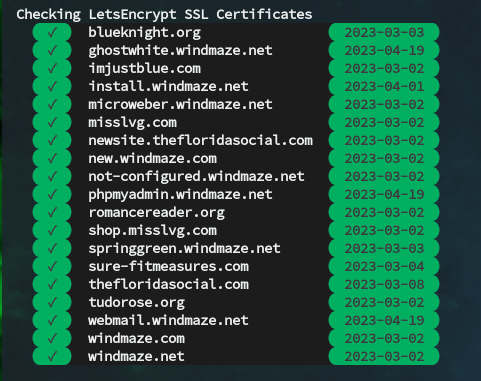

# check-letsencrypt-certs
LetsEncrypt certificate monitoring script

## 

## **Requirements**
  * OpenSSL
  * x509 Certificates

## **Execution**
  The script can be run directly or sourced. The user must have execute permissions for openssl and read access to the certificates. The script uses openssl to read the expiration date from the certificate and then displays the result with color coding. Green `#009933` means the certificate expiration is more than 14 days away. Yellow `#CCCC33` means the cert will expire within 14 days. Red `#993333` means the certificate is already expired.

## **Install Instructions.**
  ### Link method (recommended)
    Run the install.sh script as root with the --link parameter. This makes keeping the script up to date by pulling the GitHub repository. i.e.
      ```
      sudo ./install.sh --link
      ```

  ### Copy method
  	Run the install.sh script as root. i.e.
      ```
  	  sudo ./install.sh
      ```

  ### Manual install
    Simply move, copy, or link the script where you want it.
