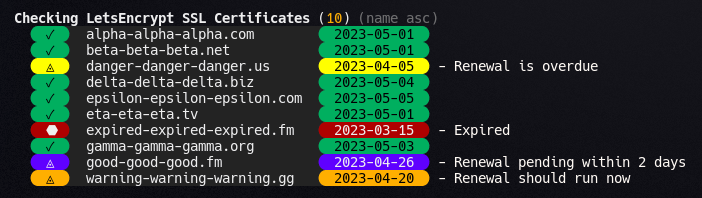

# check-letsencrypt-certs
LetsEncrypt certificate monitoring script v2

## **Examples**




## **Requirements**
* OpenSSL
* Let's Encrypt x509 Certificates

## **Upgrades in version 2**
Major additions and review.
  - Added: 2 day pending color, 7 day renewal due color.
  - Added: The ability to sort. Default is by name, but optional is date and reverse domain (tld.domain.host). Both ascending and descending.
  - Rewrite: Reworked the color function.
  - This version was a major update needed to make all these changes work.

  2023-06-08 Update
  - Changed 2 Day Pending icon to check mark.
  - Added a new feature. --renew will issue separate certobot renew commands for each cert due for renewal or overdue, but not pending or expired. Run the script with the --renew flag manually as sudo may call for your password.

## **Execution**
The script can be run directly or sourced. The user must have execute permissions for openssl and read access to the certificates. The script uses openssl to read the expiration date from the certificate and then displays the result with color coding. Green means the certificate expiration is more than 32 days away. Purple means the cert should autorenew within 2 days. Gold means the cert is within a 7 day renewal window. Yellow means the renewal is overdue and the cert will expire within 21 days. Red means the certificate is already expired. Run it directly from its location under /etc/letsencrypt/scripts. Since the script only reads the certificates, *root* permissions should not be needed.
```
/etc/letsencrypt/scripts/check-letsencrypt-certs.sh
```

## **Install Instructions.**
#### Copy method (default)
By copying the script into place, you won't need to keep the cloned version of the repo. In this method, the install script copies the script to /etc/letsencrypt/scripts. Run the install.sh script as *root*. i.e.
```
git clone https://github.com/TheBlueKnight42/check-letsencrypt-certs.git
cd check-letsencrypt-certs
sudo ./install.sh
cd ..
rm -r check-letsencrypt-certs
```

#### Link method (recommended)
Linking to the script in your cloned version of the repo makes keeping the script up to date easy by pulling the GitHub repository. In this method, the install script links from /etc/letsencrypt/scripts/check-letsencrypt-certs.sh to your cloned copy of the repo. Run the install.sh script as *root* with the `--link` parameter. i.e.
```
git clone https://github.com/TheBlueKnight42/check-letsencrypt-certs.git
cd check-letsencrypt-certs
sudo ./install.sh --link
```

#### Manual install
Simply move, copy, or link the script where you want it.
